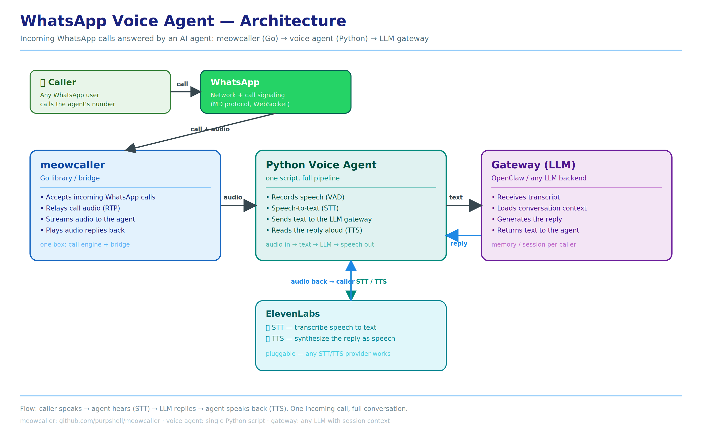

# WhatsApp Voice Agent

[](https://opensource.org/licenses/MIT)

Answer **incoming WhatsApp calls** with an AI voice agent — hear the caller, think, and speak back. Also supports **one-way outgoing announcement calls** (dial → play a pre-recorded message → hang up).

> ✅ **Inbound 1:1 calls are two-way and verified** (2026-08-15 22:05 WIB: call recorded 796 audio frames, TTS playback heard by caller, 5× barge-in interruptions worked). The multi-relay fix (PR #26) made inbound audio flow in both directions.



## No OpenClaw modifications needed

WA-call-claw works with **any OpenClaw version** — no plugins, no patches, no config edits on the OpenClaw side. The voice agent connects to the gateway over a plain WebSocket (`chat.send`); the only requirement is that the gateway's WebSocket endpoint is reachable.

It acts as an **independent input source**: WhatsApp call in → AI reply out. OpenClaw doesn't even need to know a phone call happened — it just receives text and returns text, like any other chat.

## How it works

```
Caller → WhatsApp → meowcaller (Go) → Python voice agent → Gateway (LLM)
                        ↑                                        ↓
                        └──── audio reply ← TTS ← ElevenLabs STT ┘
```

Three pieces only:

1. **meowcaller** — [Go library](https://github.com/purpshell/meowcaller) that handles WhatsApp calls: accepts incoming calls, relays audio, plays replies. Acts as the bridge between WhatsApp and the agent.
2. **Python voice agent** — a single script that runs the pipeline: record speech (VAD) → speech-to-text → send to the LLM → text-to-speech → play the reply.
3. **Gateway (LLM)** — any LLM backend with per-caller session context. It receives the transcript and returns the reply text.

Speech-to-text and text-to-speech are pluggable — [ElevenLabs](https://elevenlabs.io) works out of the box (STT: Scribe, TTS: any voice).

## Flow of one call (incoming)

1. Caller rings the agent's WhatsApp number.
2. meowcaller accepts the call and streams audio to the voice agent (multi-relay fix — audio flows both ways on 1:1 calls).
3. The agent records speech, detects end of utterance (VAD silence — client webrtcvad fallback and/or ElevenLabs server VAD), and transcribes it (STT).
4. The transcript is sent to the gateway, which loads the caller's conversation context and generates a reply.
5. The agent synthesizes the reply as speech (TTS) and streams it back through meowcaller to the caller (verified: barge-in works — caller can interrupt playback).

## Flow of one call (outgoing)

1. The bridge dials the target number (allowlist-checked, rate-limited).
2. meowcaller streams the call; the agent plays the greeting/announcement audio.
3. Optionally, the agent records the peer's speech, detects end of utterance (VAD silence), and transcribes it (STT).
4. The transcript is sent to the gateway, which loads the caller's conversation context and generates a reply.
5. The agent synthesizes the reply as speech (TTS) and streams it back through meowcaller to the caller.

## Verification status

| Use case | Status | Evidence |
|----------|--------|----------|
| Incoming call: two-way conversation (bot hears + speaks) | ✅ **Verified** | 2026-08-15 22:05 WIB — 796 frames recorded, TTS playback heard, 5× barge-in OK |
| Incoming call: auto-answer + record caller audio | ✅ Verified | 2026-08-15 22:05 (796 frames, 1.5 MB WAV) |
| Outgoing announcement call (dial → play WAV → hang up) | ✅ Verified | 3× calls 2026-08-15 17:07–17:11 |
| Outgoing call + record peer speech (STT) | ✅ Verified | 150+ frames received |
| Group calls | 🚧 In progress | core library supports it — bridge in progress |

## Caller sessions

WhatsApp identifies callers by JID (an internal ID, e.g. `1234567890@s.whatsapp.net`). The agent **translates the caller's JID to a phone number** before starting a session.

Why this matters: the voice call then continues the **same conversation session the caller already has on WhatsApp** (the text chat session keyed by phone number). Context, memory, and preferences from previous chats — text or voice — carry over into the call, and anything discussed on the call is available back in the text chat.

## Configuration

Everything user-tunable lives in a **config file** — no code changes needed. Copy `config.example.json` to `config.json` and edit:

```json
{
  "default_greeting": "assets/opening-ada-yang-bisa-kubantu.wav",
  "stt": { "provider": "elevenlabs", "model": "scribe_v2_realtime" },
  "tts": {
    "provider": "elevenlabs",
    "voice_id": "YOUR_VOICE_ID",
    "model": "eleven_multilingual_v2",
    "speed": 1.0
  },
  "vad": { "provider": "webrtcvad", "silence_ms": 1000 }
  "barge_in": { "enabled": false },
  "recording": { "record_conversation": true, "recordings_dir": "recordings" },
  "session": { "resolve_jid_to_phone": true, "load_memory": true },
  "outgoing": {
    "enabled": false,
    "allowlist": ["6281234567890"],
    "session_store_path": "",
    "session_allowlist_ttl": "60s",
    "max_calls_per_hour": 10,
    "default_delay_ms": 1000,
    "hangup_after_play_sec": 3,
    "ring_timeout": "60s",
    "audio_dir": "assets"
  }
}
```

| Key | What it does |
|-----|--------------|
| `default_greeting` | First message played when a call is picked up. Three formats (paths are relative to the config file's directory): **plain text** → synthesized with TTS; **`.txt` file path** → text is read, then synthesized with TTS; **`.wav` file path** → played **directly as-is, no TTS**. Change it anytime — no code edit. |
| `incoming.allowlist` | `true`: only callers in `incoming.allowlist_numbers` are answered — everyone else is **left ringing** (not answered, not rejected, so other devices like the owner's phone can still pick up). `false`: every call is answered. |
| `incoming.allowlist_numbers` | Phone numbers (E.164, `+` optional) that may be answered. The caller's JID/LID is **resolved to a phone number first** (LID → `GetPNForLID`, JID → bare digits) before the allowlist check, so entries are plain phone numbers only. |
| `system_prompt` | Injected into every LLM request — keeps replies TTS-friendly (see Setup §3). |
| `stt.*` | Speech-to-text provider and model. |
| `tts.*` | Text-to-speech provider, voice ID, model, playback speed. |
| `vad.provider` | VAD engine: `webrtcvad` (client-side commit, default) or `elevenlabs` (server-side commit via `commit_strategy=vad`, client VAD kept as safety net). **Note:** in live calls the ElevenLabs server-side commit rarely fires (known behavior) — the client webrtcvad fallback does the actual commit, so `silence_ms` is the effective knob. |
| `vad.silence_ms` | Silence duration that ends the caller's turn — client-side VAD (and fallback for `elevenlabs`). |
| `vad.min_silence_duration_ms` | Server VAD: silence that ends a turn (`elevenlabs` only). Sent to the API but effectively ignored in live calls (see note above). |
| `vad.min_speech_duration_ms` | Server VAD: minimum speech before a turn can commit (`elevenlabs` only). |
| `vad.vad_silence_threshold_secs` | Server VAD: speech-vs-silence sensitivity (`elevenlabs` only). |
| `barge_in.enabled` | `false` (default): user speech **never** interrupts agent playback — responses always play to completion (noise-safe). `true`: speaking while the agent talks stops playback immediately (server VAD events arm it — reliable even during TTS playback). |
| `recording.record_conversation` | `true` (default): record **both sides** of the call (caller + agent TTS) into `conversation-<call_id>.wav` (16 kHz mono s16le). The bridge's `incoming-*.wav` only has the caller's side — this mixes both. `false`: disabled. |
| `recording.recordings_dir` | Output directory for conversation recordings (relative paths resolve against the config file's directory). Raw `caller-*.pcm` / `agent-*.pcm` tracks are written live and removed after mixing; if the agent crashes mid-call they remain for manual mixing. |
| `session.resolve_jid_to_phone` | Translate JID → phone number so calls share the caller's WhatsApp session. |
| `session.load_memory` | `true` (default): resolve the caller's existing OpenClaw session & load its `.memory.md` into the voice prompt. `false`: start a **fresh isolated voice session** — no historical chat from the caller's existing session. System prompt, MD profile files, tools & skills still load because `chat.send` runs through the OpenClaw gateway. |
| `outgoing.enabled` | Enable one-way outbound announcement calls (`POST /api/call` on the bridge). |
| `outgoing.allowlist` | Static allowlist of numbers that may be called (E.164, no leading `+`). |
| `outgoing.session_store_path` | Optional path to OpenClaw's `sessions.json` — numbers with an active session are also allowed (dynamic allowlist, refreshed every `session_allowlist_ttl`). |
| `outgoing.max_calls_per_hour` | Rate limit: max outbound calls per rolling hour. |
| `outgoing.default_delay_ms` | Silence after the peer answers, before the announcement plays. |
| `outgoing.hangup_after_play_sec` | Grace period after the WAV finishes before hanging up (total = delay + WAV duration + grace). |
| `outgoing.ring_timeout` | Unanswered calls hang up after this long. |
| `outgoing.audio_dir` | Directory where WAV filenames passed to `/api/call` are resolved. |

The config file path can be overridden with the `CONFIG_PATH` environment variable.

## Outgoing calls (one-way announcement)

Dial a number → wait for the peer to answer → silence (`default_delay_ms`) →
play a WAV announcement → hang up `hangup_after_play_sec` seconds after the
WAV finishes. Unanswered calls hang up after `ring_timeout`.

```
POST /api/call                      # on the bridge HTTP port (same as the WS)
{"type":"outgoing_call","phone":"6281234567890","audio":"pesan.wav","delay_ms":1000}

200 → {"type":"outgoing_call_ack","status":"accepted","call_id":"..."}
409 → {"type":"outgoing_call_ack","status":"rejected","reason":"..."}
503 → outgoing disabled
```

`audio` is resolved relative to `outgoing.audio_dir`; `delay_ms` overrides
`default_delay_ms` when present. Rejections (not in allowlist, rate-limited,
bad format) return HTTP 409 with a `reason`. Completed calls write a
`call-ended-*.json` event with `direction: "outgoing"` and an `outcome`
(`completed` / `no-answer` / `busy` / `failed`).

## Install with an AI agent

Point your AI assistant at this repo — no need to copy commands by hand:

> **"Install WA-call-claw following the repo."**
> *(or: "Set up WA-call-claw from the repo, follow what's in there")*

The agent must read **[AGENTS.md](AGENTS.md)** — a step-by-step setup guide written
for AI agents (prerequisites → build → config → env vars → supervisor →
verification → troubleshooting). **AGENTS.md is the single source of truth for
installing and operating WA-call-claw**; this README covers architecture and the
configuration reference.

If you prefer setting it up yourself, follow the steps below.

## Setup

### Scripts

| Script | Where | What it does |
|--------|-------|--------------|
| `cmd/meowcaller-poc/main.go` | `bridge/cmd/meowcaller-poc/` | Go bridge: accepts WhatsApp calls, relays audio |
| `meowcaller_openclaw_voice.py` | `voice-agent/` | **Main voice agent** — full pipeline (VAD → STT → LLM → TTS) |
| `openclaw_gateway_client.py` | `voice-agent/` | WebSocket client for the LLM gateway (heartbeat + reconnect) |
| `openclaw_session_resolver.py` | `voice-agent/` | Resolves caller JID → phone number → session |
| `voice_context_router.py` | `voice-agent/` | Loads the caller's stored memory into the LLM context |
| `elevenlabs_stt_agent.py` | `voice-agent/` | Speech-to-text (ElevenLabs Scribe) |
| `tts_client.py` | `voice-agent/` | Text-to-speech (ElevenLabs) |
| `run_openclaw_voice.sh` | `voice-agent/` | One-shot launcher: config + env + voice agent |
| `supervisor.sh` | `supervisor/` | Keeps bridge + voice agent alive (auto-restart) |

### 1. Setup meowcaller (Go bridge)

```bash
cd bridge
go build -o meowcaller-poc ./cmd/meowcaller-poc
./meowcaller-poc
```

First run links your WhatsApp account (QR login, like WhatsApp Web). The session is saved and reused on later runs.

### 2. Setup the Python agent

```bash
cd voice-agent
python3 -m venv .venv
.venv/bin/pip install -r requirements.txt
cp ../config.example.json config.json   # then edit: greeting, voice_id, prompt
export ELEVENLABS_API_KEY="your-key-here"
export GATEWAY_URL="ws://127.0.0.1:18789"
./run_openclaw_voice.sh                 # or: python meowcaller_openclaw_voice.py
```

Environment variables:

| Variable | Required | Purpose |
|----------|----------|---------|
| `ELEVENLABS_API_KEY` | ✅ | STT + TTS |
| `GATEWAY_URL` | ✅ | LLM gateway WebSocket address |
| `CONFIG_PATH` | ❌ | Override config file location (default `config.json`) |
| `BRIDGE_PORT` | ❌ | Bridge socket port (must match the bridge) |

### 3. System prompt for the gateway (OpenClaw)

Replies are read aloud by TTS, so the LLM should know how to format them. Set this as the agent's system prompt (or keep it in `config.json` under `system_prompt`):

> You are a WhatsApp voice assistant. Your replies are read aloud by a text-to-speech engine: answer concisely in the caller's language, no markdown, no emoji, no bullet points, keep it short and natural like spoken conversation.

The agent injects this prompt into every request, so any OpenClaw/OpenAI-compatible gateway can consume it directly.

### 4. Supervisor (optional, recommended)

A small script keeps the bridge and the voice agent alive — if either crashes, it is restarted within seconds:

```bash
cd supervisor
chmod +x supervisor.sh
nohup ./supervisor.sh > /dev/null 2>&1 &
```

It is fully configurable via environment variables (paths, commands, check interval, restart limits) and ships with a systemd service template. See [`supervisor/README.md`](supervisor/README.md).

## ElevenLabs setup

1. Create an account at [elevenlabs.io](https://elevenlabs.io) and grab an API key.
2. Export it as an environment variable (the agent reads it from the environment — **never put keys in `config.json`**):

```bash
export ELEVENLABS_API_KEY="your-key-here"
```

3. Pick a voice: copy any voice ID from the ElevenLabs dashboard into `tts.voice_id` in your config.

STT and TTS in this release use ElevenLabs.

## Requirements

- Go 1.2x, Python 3.10+
- A WhatsApp account for the agent
- An LLM backend (OpenClaw, OpenAI-compatible, etc.)
- STT/TTS API keys (ElevenLabs recommended)

## Status

- ✅ Incoming 1:1 calls — **two-way, verified** (record caller audio + TTS playback heard by caller + barge-in)
- ✅ Outgoing calls (one-way WAV announcement, allowlist, rate limit) — **verified**
- 🚧 Group calls (core library supports it — bridge in progress)

## License

[MIT](LICENSE) — free to use, modify and distribute, including commercially. You only need to keep the copyright notice. © 2026 sroxoxagent

---

## Repository structure

```
WA-call-claw/
├── AGENTS.md            # ⭐ Setup guide for AI agents — read this first when installing
├── bridge/              # Go bridge (meowcaller): cmd/, internal/, third_party/
│   ├── config.yaml.example
│   └── README.md        # technical bridge docs (POC scope)
├── voice-agent/         # Python voice agent: STT → LLM → TTS pipeline
│   ├── config.json.example
│   ├── assets/          # greeting audio
│   └── tests/
├── scripts/             # CLI & tooling: wacall.py (outgoing call), deploy.sh, bridge scripts
├── supervisor/          # supervisor v3: keeps bridge + voice agent alive
├── config.example.json  # example voice agent config (top-level)
└── wa-call-simple.png   # architecture diagram
```

> **Installing?** Read [AGENTS.md](AGENTS.md) — the step-by-step setup guide for AI agents.
> Simply tell your assistant: *"Install WA-call-claw following the repo."*

## Development workflow

- **Edit code** in this repo (bridge/ = Go, voice-agent/ = Python).
- **Deploy to runtime**: `./scripts/deploy.sh` — syncs `bridge/` → `TMP/meowcaller-poc/`, builds the binary, restarts the bridge, verifies automatically. The runtime keeps running from `TMP/` (binary + config + logs); this repo is the single source of truth.
- **Active config** is never committed (`.gitignore`). Examples: `bridge/config.yaml.example`, `voice-agent/config.json.example`.
